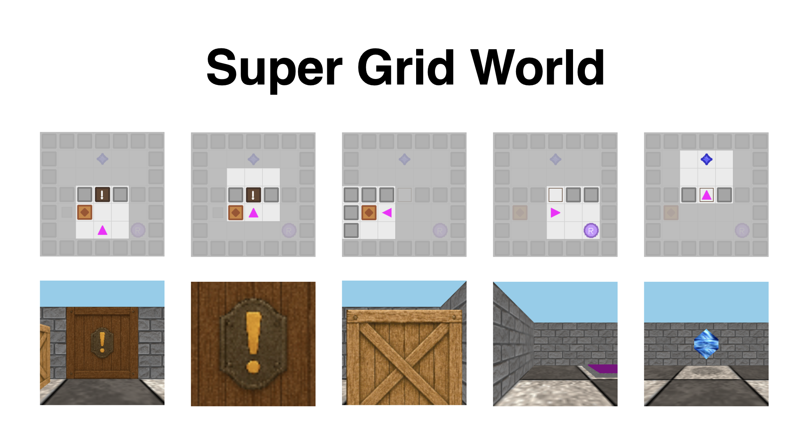

# Super Grid World



[](https://opensource.org/licenses/Apache-2.0)

Super Grid World is a flexible and customizable grid world environment implemented in Python. It's designed for research, particularly in reinforcement learning, offering various configurations for observation types, control schemes, and environment layouts. It is a heavily-modified fork of the GridEnv present in the [Neuro-Nav library](https://github.com/awjuliani/Neuro-Nav).

## Installation

1.  **Clone the repository:**
    ```bash
    git clone https://github.com/awjuliani/super-grid-world.git
    cd super-grid-world
    ```

2.  **Install the package:**
    It's recommended to use a virtual environment (e.g., `venv`, `conda`).
    ```bash
    pip install .
    ```
    For development, you might also want to install testing dependencies:
    ```bash
    pip install -r requirements-dev.txt
    ```

## Usage

You can interactively play in the environment using the `play.py` script.

```bash
python play.py [OPTIONS]
```

**Available Options:**

*   `--template`: Name of the environment template to load (default: `linked_door_test`).
*   `--obs_type`: Observation type (`visual_2d` or `visual_3d`, default: `visual_2d`).
*   `--control`: Control type (`allocentric` or `egocentric`, default: `allocentric`).
*   `--manual_interact`: Enable manual interaction/collection with the 'E' key.
*   `--resolution`: Display resolution (default: `512`).

**Example:**

```bash
# Run with default settings (linked_door_test, visual_2d, allocentric)
python play.py

# Run with 3D visuals and egocentric controls
python play.py --obs_type visual_3d --control egocentric

# Run a specific template with manual interaction enabled
python play.py --template my_custom_template --manual_interact
```

**Controls:**

*   **Allocentric:**
    *   `W`: Move North
    *   `S`: Move South
    *   `A`: Move West
    *   `D`: Move East
*   **Egocentric:**
    *   `W`: Move Forward
    *   `A`: Rotate Left
    *   `D`: Rotate Right
*   **Interaction (if `--manual_interact` is enabled):**
    *   `E`: Collect / Interact
*   **Quit:**
    *   `Q`: Quit the game

Events and rewards will be printed to the terminal.

## Features

*   **Customizable Environments:** Load different environment layouts using templates.
*   **Multiple Observation Types:** Supports 2D (`visual_2d`) and 3D (`visual_3d`) visual observations.
*   **Flexible Control Schemes:** Choose between allocentric (world-based) and egocentric (agent-based) controls.
*   **Interactive Play:** Includes a script (`play.py`) for manual interaction and testing.
*   **Gymnasium Compatible:** (Assumed, based on `gym` dependency - verify if true) The environment likely follows the Gymnasium (formerly Gym) API standard.
*   **Event System:** Provides feedback on agent interactions and environment events.

## Dependencies

*   Python 3.x
*   numpy
*   gymnasium (or gym)
*   matplotlib
*   scipy
*   opencv-python
*   PyOpenGL
*   PyVirtualDisplay
*   torch
*   glfw

## License

This project is licensed under the Apache License 2.0 - see the [LICENSE](LICENSE.md) file for details.

## Author

*   **Arthur Juliani** - [awjuliani@gmail.com](mailto:awjuliani@gmail.com) - [GitHub](https://github.com/awjuliani)